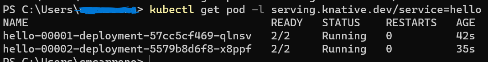

# How to run knative in Windows with Minkube and Rancher Desktop

### Requirements
-   Install kubectl
-   Install Rancher Desktop
-   Install minikube


### Configurations
First, in windows you probably have the port 80 busy by the service http or by traefik if you're using Rancher desktop (I couldn't expose the loadbalancer with it, so, I prefer to use kourier).

Open the terminal with admin perms and run (probably you'll need to run it every time you switch on your laptop):
```net stop http```

Maybe your iphlpsvc (Windows IP Helper Service) is running in port 80 as well. If this is the case, run this:
```netsh interface portproxy show all```
Check if it's running on port 80 and if this is the case:
```netsh interface portproxy delete v4tov4 listenport=80 listenaddress=0.0.0.0```

This is going to stop the http service tht is running on port 80.
Now, go to rancher desktop and disable the traefik:
1.  Right click in the rancher desktop icon:
2.  Open the main window:  
3.  Click on configuration: 
4.  Disable the traefik: 

Copy the knative-op folder in your C disk root. 
Go to your environment variables and in the path add this route:
In my case the name of the folder is knative.

## Install knative with minikube
Install it with minikube is super easy, it's just like in the knative documentation.
Open a new terminal and run:

```kn quickstart minikube```

This is going to install all the component in a new cluster named **knative**.
At some point in the installation you need to run in another terminal window the next command:

```minikube tunnel --profile knative```

Once it's finished you can start working with knative serving service or with knative eventing service.

## Install knative in rancher-desktop

1.  Install crds, knative-serving and kourier:

```$KNATIVE_VERSION="1.11.1"```
``` kubectl apply -f https://github.com/knative/serving/releases/download/knative-v${KNATIVE_VERSION}/serving-crds.yaml```
```kubectl apply -f https://github.com/knative/serving/releases/download/knative-v${KNATIVE_VERSION}/serving-core.yaml```
```$KNATIVE_NET_KOURIER_VERSION="1.11.2"```
``` kubectl apply -f https://github.com/knative/net-kourier/releases/download/knative-v${KNATIVE_NET_KOURIER_VERSION}/kourier.yaml```

2.  Get the external ip:
```kubectl -n kourier-system get service kourier -o jsonpath='{.status.loadBalancer.ingress[0].ip}```
3.  Patch the config-domain and replace the external ip in this command:
```kubectl patch configmap -n knative-serving config-domain -p '{\"data\": {\"{EXTERNAL_OP}.sslip.io\": \"\"}}'```    
4.  Patch the config-network:
```kubectl patch configmap/config-network --namespace knative-serving --type merge --patch '{\"data\":{\"ingress.class\":\"kourier.ingress.networking.knative.dev\"}}'```

With this you can use knative-serving.

Steps for install knative-eventing:

1.  Install crd, knative-eventing, in-memory channel and in-memory broker:
```$KNATIVE_EVENTING_VERSION="1.11.3"```
```kubectl apply --filename https://github.com/knative/eventing/releases/download/knative-v${KNATIVE_EVENTING_VERSION}/eventing-crds.yaml```
```kubectl apply --filename https://github.com/knative/eventing/releases/download/knative-v${KNATIVE_EVENTING_VERSION}/eventing-core.yaml```
```kubectl apply --filename https://github.com/knative/eventing/releases/download/knative-v${KNATIVE_EVENTING_VERSION}/in-memory-channel.yaml```
```kubectl apply --filename https://github.com/knative/eventing/releases/download/knative-v${KNATIVE_EVENTING_VERSION}/mt-channel-broker.yaml```
2.  Create the broker:
```kn broker create example-broker```
3. List the broker:
```kn broker list```

And that's all. You have both services availables in rancher-desktop.

## Knative Serving

First, we need to check that we're using the right context:

```kubectl config get-contexts```

If you're using minikube, the context must be knative.
If you're using rancher, the context must be rancher-desktop.
If the context is different you can set it:

```kubectl config use-context knative/rancher-desktop```

Ok, now, we´re sure that we´re using the proper context. Deploy a service in knative is quite simple.

```kn service create hello --image ghcr.io/knative/helloworld-go:latest --port 8080 --env TARGET=World```

Check that the service is running:

```$SERVICE_URL=(kubectl get ksvc hello -o jsonpath='{.status.url}')```
```curl $SERVICE_URL```

And you should see something like that:


#### Autoscaling

You can check how the service can scale up and scale down:
```kubectl get pod -l serving.knative.dev/service=hello -w```

Now, run the curl again and wait:


#### Traffic splitting

Now, update the service with a new version that use a new TARGET variable:

```kn service update hello --env TARGET=Knative```


if you run:

```kn revisions list```

You can see all the traffic is going through the last version. You can change it:

```kn service update hello --traffic hello-00001=50 --traffic @latest=50```

if you run curl several times, you should receive different responses:




## Knative eventing

First, check that your broker is up and running:

```kn broker list```

Ok, once you see that we have a broker up, we can deploy the cloudevents player that is going to send events to this broker:

```kn service create cloudevents-player --image quay.io/ruben/cloudevents-player:latest```

The service is now running but it doesn't know where the broker is so let's create a SinkBinding between the service and the broker.

```kn source binding create ce-player-binding --subject "Service:serving.knative.dev/v1:cloudevents-player" --sink broker:example-broker```

Now, open the cloudevents url:


Fill the fields and send the event:


With that, your message was sent to your broker.
The next step is to create a trigger and react to these messages that are in your broker.

For this demo, our sink is going to be our cloudevents app as well:

```kn trigger create cloudevents-trigger --sink cloudevents-player  --broker example-broker```

Ok, all is configured. The last thing is to send a new message and see how it's recived by cloudevents app:


As you can see, the message was sent and then received by the same app.

## Summary

So, the env is ready and you can start playing with both services.